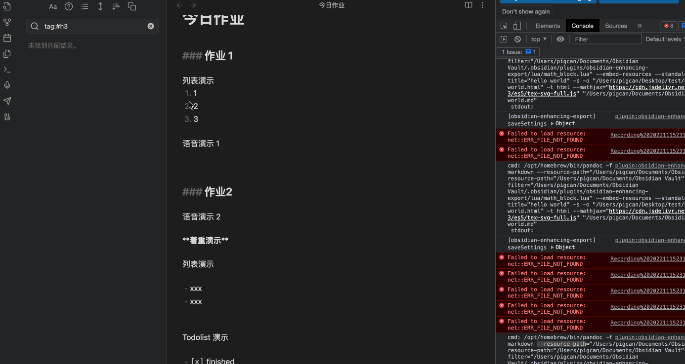

# Homework

作业生成器

把 md 文件转换生成一个可被直接预览的 HTML 文件（作业中的图片文件和音频文件会被内联至 HTML 中）

md 编辑器推荐 [obsdian](https://obsidian.md/) 


## 演示



## 环境要求

### Nodejs

[Nodejs 安装方式](https://nodejs.org/en/)

### Pandoc 

[Pandoc 安装方式](https://pandoc.org/installing.html)

## 安装方式

```bash
$ npm install -g ff-homework
```

## 执行方式

在 `obsdian` 的目录中执行 `hw` 命令即可.

以 mac 为例，`obsdian` 的文件目录在 `/Users/pigcan/Documents/Obsidian Vault`

所以需要预先
```bash
$ cd  /Users/pigcan/Documents/Obsidian\ Vault/
$ hw
```